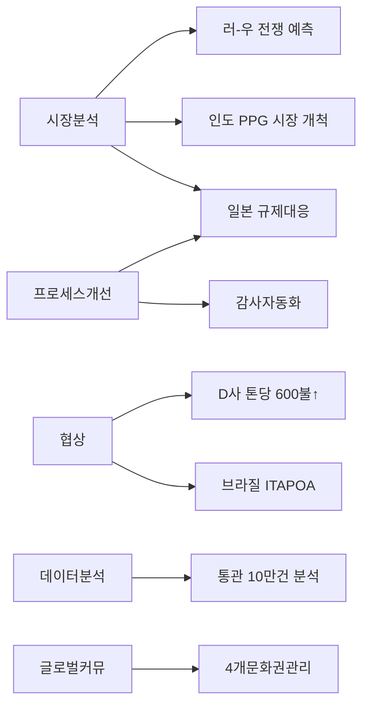

# 🧠 홍석진 스킬 그래프

> *"시장을 읽고, 기회를 잡고, 연결하는 사람"*

---

## 🎯 스킬 레이더

```
                    시장분석 ★★★★★
                         /\
                        /  \
                       /    \
          데이터분석 ★★★★    ★★★★★ 협상
                     /        \
                    /          \
                   /            \
        글로벌커뮤 ★★★★        ★★★★ 프로세스개선
                   \            /
                    \          /
                     \        /
         수출입실무 ★★★★    ★★★★ 사업기획
                       \    /
                        \  /
                         \/
                    전략적사고 ★★★★★
```

## 📊 스킬 매트릭스

### 🥇 Core Skills (★★★★★)

| 스킬 | 레벨 | ██████████ | 증거 |
|------|:--:|------------|------|
| **시장 분석** | ▓▓▓▓▓▓▓▓▓░ | 90% | 인도·일본·남미·유럽 시장 분석, 수출입 동향 추적 |
| **B2B 협상** | ▓▓▓▓▓▓▓▓▓░ | 90% | 30달러 인하 방어, 톤당 600달러 인상, 2,350→2,370 계약 |
| **전략적 사고** | ▓▓▓▓▓▓▓▓▓░ | 88% | 러-우 전쟁 예측, 공급망 리스크 분석, 타이밍 전략 |

### 🥈 Strong Skills (★★★★)

| 스킬 | 레벨 | ██████████ | 증거 |
|------|:--:|------------|------|
| **데이터 분석** | ▓▓▓▓▓▓▓▓░░ | 80% | 10만 건 통관 데이터 파이썬 전처리, AI·VBA 자동화 |
| **글로벌 커뮤니케이션** | ▓▓▓▓▓▓▓▓░░ | 80% | 4개 문화권 거래처 동시 관리, 러·영·일 3개국어 |
| **프로세스 개선** | ▓▓▓▓▓▓▓▓░░ | 78% | 일본 규제대응 50% 단축, 감사자료 1개월→3일 |
| **사업기획** | ▓▓▓▓▓▓▓▓░░ | 75% | 손익 분석, 판가 전략, 시장 진입 검토 |
| **수출입 실무** | ▓▓▓▓▓▓▓▓░░ | 75% | Incoterms, L/C, CI/PL/BL, 외국환거래, 통관 |

### 🥉 Growing Skills (★★★)

| 스킬 | 레벨 | ██████████ | 증거 |
|------|:--:|------------|------|
| **PT 발표** | ▓▓▓▓▓▓▓░░░ | 65% | 한화 PT면접, 고객사 세미나 기획·발표 |
| **Key Account 관리** | ▓▓▓▓▓▓░░░░ | 55% | 장기 파트너십 구축, 반복 거래 전환 |
| **재무/원가 분석** | ▓▓▓▓▓░░░░░ | 50% | 추정손익, PO 가격 동향, 원가회계 독학 |

---

## 🗣️ 언어

| 언어 | 수준 | 용도 |
|------|:----:|------|
| 🇰🇷 한국어 | 원어민 | 모국어 |
| 🇬🇧 영어 | 비즈니스 (OPIc AL) | 글로벌 커뮤니케이션, 협상 |
| 🇷🇺 러시아어 | 비즈니스 (OPIc AL) | 동유럽·CIS 시장 |
| 🇯🇵 일본어 | 기초 | 일본 거래처 보조 |

---

## 🔗 스킬 ↔ 경험 매핑



---

## 🏢 스킬 ↔ 직무 적합도

| 직무 | 시장분석 | 협상 | 데이터 | 글로벌 | 프로세스 | **종합** |
|------|:--:|:--:|:--:|:--:|:--:|:--:|
| **해외영업** | ●●●●○ | ●●●●● | ●●●○○ | ●●●●○ | ●●●○○ | **85%** |
| **사업개발(BD)** | ●●●●● | ●●●●○ | ●●●●○ | ●●●●○ | ●●●○○ | **82%** |
| **글로벌 B2B** | ●●●●○ | ●●●●○ | ●●●○○ | ●●●●● | ●●●○○ | **80%** |
| **전략기획** | ●●●●● | ●●○○○ | ●●●●○ | ●●●○○ | ●●●○○ | **70%** |
| **공급망/물류** | ●●●○○ | ●●●○○ | ●●○○○ | ●●●○○ | ●●●●○ | **65%** |

---

## 📈 스킬 성장 로드맵

```
현재 ──────────────── 1년 후 ──────────────── 3년 후

시장분석 ▓▓▓▓▓▓▓▓▓░ → ▓▓▓▓▓▓▓▓▓▓ → ▓▓▓▓▓▓▓▓▓▓  (Mastery)
협상력   ▓▓▓▓▓▓▓▓▓░ → ▓▓▓▓▓▓▓▓▓▓ → ▓▓▓▓▓▓▓▓▓▓  (Mastery)
데이터   ▓▓▓▓▓▓▓▓░░ → ▓▓▓▓▓▓▓▓▓░ → ▓▓▓▓▓▓▓▓▓▓  (Python 고급)
글로벌   ▓▓▓▓▓▓▓▓░░ → ▓▓▓▓▓▓▓▓▓░ → ▓▓▓▓▓▓▓▓▓▓  (MBA/현지경험)
재무     ▓▓▓▓▓░░░░░ → ▓▓▓▓▓▓▓░░░ → ▓▓▓▓▓▓▓▓░░  (P&L Mastery)
리더십   ▓▓▓▓░░░░░░ → ▓▓▓▓▓░░░░░ → ▓▓▓▓▓▓▓░░░  (팀 리드)
```

## 🔗 연관 페이지
- [[직무별_인덱스]] — 모든 직무 페이지
- [[경험별_인덱스]] — STAR 경험 블록
- [[achievements]] — 정량적 성과
- [[industries]] — 산업 도메인 지식
- [[커리어_전략_마스터]] — 커리어 방향성
